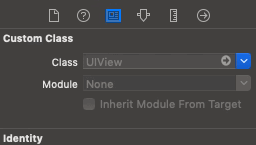
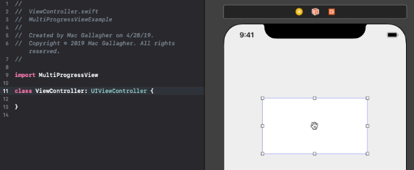

# MultiProgressView

[](https://travis-ci.org/mac-gallagher/MultiProgressView)


[](https://github.com/Carthage/Carthage)
[](https://codecov.io/gh/mac-gallagher/MultiProgressView)

# About
**MultiProgressView** is an animatable view that depicts multiple progresses over time. The `MultiProgressView` class mimics `UIProgressView` as much as possible while providing additional customizations. 

# Example

To run the example project, clone the repo and run the `MultiProgressViewExample` target.


# Requirements
* iOS 9.0+
* Xcode 10.2+
* Swift 5.0+

# Installation

### CocoaPods
MultiProgressView is available through [CocoaPods](<https://cocoapods.org/>). To install it, simply add the following line to your Podfile:

	pod 'MultiProgressView'

### Carthage

MultiProgressView is also avaiable through [Carthage](<https://github.com/Carthage/Carthage>). To install it, simply add the following line to your Cartfile:

	github "mac-gallagher/MultiProgressView"

### Manual
Download and drop the `MultiProgressView` directory into your project.

# Usage

## Programmatic
1. Add a `MultiProgressView` to your view hierarchy:

    ```swift
    let progressView = MultiProgressView()
    view.addSubview(progressView)
    ```
    
2. Conform your class to the `MultiProgressViewDataSource` protocol and set your progress view's `dataSource`:

    ```swift
    func numberOfSections(in progressView: MultiProgressView) -> Int
    func progressBar(_ progressView: MultiProgressView, viewForSection section: Int) -> ProgressViewSection
    ```
    
    ```swift
    progressView.dataSource = self
    ```
3. Call `setProgress(section:to:)` to update your view's progress:

    ```swift
    progressView.setProgress(section: 0, to: 0.4)
    ```

## Using Storyboards

1. Drag a `UIView` onto your view controller and set the view's class to `MultiProgressView` in the *Identity Inspector*:

   

3. Connect your progress view to your view controller with an `IBOutlet`:

   

4. Conform your view controller to the `MultiProgressViewDataSource` protocol and implement the required methods:
 
   ```swift
    func numberOfSections(in progressView: MultiProgressView) -> Int
    func progressBar(_ progressView: MultiProgressView, viewForSection section: Int) -> ProgressViewSection
    ```
     
5. Set your view controller as the progress view's `dataSource`:
   
   

6. Call `setProgress(section:to:)` to update your view's progress:

    ```swift
    progressView.setProgress(section: 0, to: 0.4)
    ```
    
## Customization

### MultiProgressView
Each `MultiProgressView` exposes the variables listed below. If using storyboards, many of these properties can be customized directly in the view's *Attribute Inspector*.


```swift
var cornerRadius: CGFloat = 0
var borderWidth: CGFloat = 0
var borderColor: UIColor? = .black
var lineCap: LineCapType = .square 

var trackInset: CGFloat = 0
var trackBackgroundColor: UIColor? = .clear
var trackBorderColor: UIColor? = .black
var trackBorderWidth: CGFloat = 0

var trackImageView: UIImageView

var trackTitleLabel: UILabel
var trackTitleEdgeInsets: UIEdgeInsets = .zero
var trackTitleAlignment: AlignmentType = .center
```

**Note**: To apply a corner radius (using `layer.cornerRadius` or the `cornerRadius` variable) the `lineCap` type must be set to `.round`.


### ProgressViewSection
Each `ProgressViewSection` exposes the following variables:

```swift
var imageView: UIImageView
var titleLabel: UILabel
var titleEdgeInsets: UIEdgeInsets = .zero
var titleAlignment: AlignmentType = .center
```

### Animating your progress
The `setProgress(section:to:)` function be animated. For example:

```swift
UIView.animate(withDuration: 0.2) {
    self.progressView.setProgress(section: 0, to: 0.4)
}
```

# Contributing
- If you **found a bug**, open an issue and tag as bug.
- If you **have a feature request**, open an issue and tag as feature.
- If you **want to contribute**, submit a pull request.
	- In order to submit a pull request, please fork this repo and submit a pull request from your forked repo.
	- Have a detailed message as to what your pull request fixes/enhances/adds.

# To-do
- [ ] Swift Package Manager support
- [ ] Progress object (Foundation) support
- [x] Storyboard/`IBInspectable` support

# Author
Mac Gallagher, jmgallagher36@gmail.com.

# License
MultiProgressView is available under the [MIT License](LICENSE), see LICENSE for more infomation.
